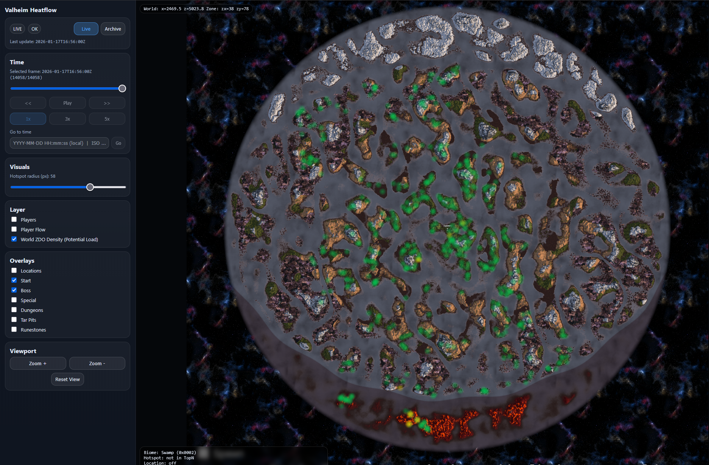

# Valheim Atlas


> Independent, unofficial project.  
> Not affiliated with, endorsed by, or supported by Iron Gate AB or Valheim.  
> This tool does not modify gameplay and is not an MMO framework.
>
> “Valheim” is a registered trademark of Iron Gate AB.

---

## Overview

Valheim Atlas is a **read-only analysis and visualization tool** for Valheim servers.

It helps server operators understand how their world is actually used over time:
where players concentrate, how movement flows across the map,
and how persistent world load evolves as the server grows.

Valheim Atlas does **not** change gameplay, balance, mechanics, or progression.
It only observes, aggregates, and visualizes server-side data.

---

## Use Case

Valheim Atlas is designed for **server administrators and operators** who want
long-term visibility into world activity and load patterns.

Typical questions Valheim Atlas helps answer:

- Where do players concentrate during peak hours?
- Which areas of the world accumulate high ZDO density?
- How does player movement flow between regions?
- How does world load evolve over days or weeks?
- Are there emerging hotspots caused by building or activity clustering?

The tool is especially useful for:
- Persistent or long-running servers
- Community build worlds
- Performance and stability observation
- Historical analysis (without wipes)

---

## System Architecture

Valheim Atlas consists of three components that form a simple, one-directional pipeline:

1. **Server Plugin**  
   A lightweight BepInEx plugin emits telemetry data from the Valheim server.

2. **Aggregator**  
   A Python-based process aggregates raw events into time-based frames
   and prepares them for visualization.

3. **Static Web Viewer**  
   A browser-based viewer renders maps, overlays, and timelines
   from the aggregated data.

Data always flows in one direction:

Valheim Server → Plugin → Aggregator → Static Viewer


There is no live server interaction and no client-side dependency.

---

# Plugin Installation (BepInEx)

The Valheim Atlas plugin is distributed as a **prebuilt DLL via GitHub Releases**.

### Installation

1. Download the latest plugin DLL from the GitHub Releases page
2. Place the DLL into:

```
BepInEx/plugins/
```

3. Restart the Valheim server

The plugin:
- has no in-game UI
- does not affect gameplay
- only emits telemetry data

---

# Aggregator

The aggregator is a Python script that:
- reads emitted telemetry data
- groups events into time buckets
- produces frame-based JSON outputs
- maintains lightweight health and state metadata

It is designed to:
- run alongside the server
- fail safely (no hard crashes)
- regenerate derived data from existing frames

See:
 `docs/Data_Streams_Explanation/Aggregator_Explanation.md`
 `docs/DEBUG_RUNBOOK.md`

## Configuration

By default, the Valheim Atlas aggregator expects its input data in a local
input/ directory relative to its working directory.

However, the Valheim Atlas server plugin writes telemetry data to the following
location by default:

```
BepInEx/config/heatflow/
```
This means one of the following setups is required at startup.


**Option 1: Pass input directory explicitly (recommended)**

Run the aggregator with an explicit input path pointing to the plugin output:

```
python aggregator.py --input /path/to/Valheim/BepInEx/config/heatflow
```
**Option 2: Symlink or copy data into input/**

Create a symlink or periodically copy the plugin output directory
into the aggregator's expected input/ directory.

Linux / Unix:
```
ln -s /path/to/Valheim/BepInEx/config/heatflow ./input
```

Windows (directory junction):
```
mklink /J input C:\path\to\Valheim\BepInEx\config\heatflow
```

The default behavior is intentional to keep the aggregator decoupled from any
specific Valheim or BepInEx installation.

The aggregator does not modify input data.
It only reads and aggregates existing telemetry files.

# Persistent Integration

Valheim Atlas is designed to run alongside a long-lived (“forever”) Valheim server
without requiring wipes, resets, or manual intervention during normal operation.
This section describes how to integrate the aggregator into a running server
and how to operate it safely over long time spans.

## Recommended Runtime Model

Valheim Atlas follows a sidecar model:

- The Valheim server runs unchanged
- The Atlas plugin emits append-only JSONL telemetry
- The Python aggregator runs as a long-lived companion process
```
Valheim Server (BepInEx)
├─ BepInEx/config/heatflow/*.jsonl   ← raw telemetry (append-only)
│
├─ aggregator (Python process)
│   ├─ state/     ← offsets + caches
│   ├─ out/       ← live + archive frames
│   └─ archive/   ← rotated monthly data (optional)
│
└─ static viewer (served or opened locally)
```

The aggregator must not run inside the Valheim process.
It should be managed independently (systemd, tmux, Docker, etc.).

## Integrating Aggregator Start/Stop into Server Operation

For long-running servers, the Atlas aggregator should be started and stopped
via scripts that are referenced by the Valheim server startup/shutdown process.

The aggregator is intended to run as a managed companion process
(e.g. via start/stop scripts, systemd, tmux, Docker, or similar),
not as a manually launched tool.

Typical setup:
- Valheim server startup script starts the aggregator
- Valheim server shutdown script stops the aggregator

The aggregator can be started safely at any time.
It will resume from its last persisted offsets.

Example (Linux, simplified):
```
python aggregator.py \
  --input /path/to/Valheim/BepInEx/config/heatflow \
  --out   /path/to/atlas/out \
  --state /path/to/atlas/state
```
The aggregator writes offsets and state continuously.
No special shutdown step is required.

## Safe Restart Behavior (No Data Loss)

The aggregator is designed to survive restarts:

- Stream offsets are persisted in state/offsets.json
- World ZDO density cache is persisted in state/world_zdos_cache.json
- Player and flow TTL are frame-based and re-established naturally

On restart:
- No historical data is re-counted
- No frames are invalidated
- Visualization resumes seamlessly

A restart of the server, the aggregator, or both
does not require a wipe or reset.

## Enabling Long-Term Operation

To keep a Valheim Atlas installation healthy over months or years,
the following practices are recommended.

### **1. Monthly Rotation (Raw Data + Frames)**

Raw JSONL streams and frame archives grow indefinitely by design.
Use the provided rotation tool during a restart window
(e.g. once per month):
```
python tools/rotate_monthly.py
```

This will:
- archive previous-month JSONL streams (gzipped)
- archive previous-month frames
- keep current-month data intact
- preserve playback integrity
- Rotation is idempotent and safe.

### **2. Never Delete state/ During Normal Operation**

The state/ directory contains:
- stream offsets
- cached world ZDO density

Deleting it will cause:

- loss of restart continuity
- unnecessary re-aggregation
- distorted historical thresholds

Only delete state/ if you explicitly want a fresh logical start.

### **3. World Growth**

Valheim Atlas does not assume a bounded world lifetime.
World ZDO density is:
- incremental
- epoch-based
- lazily overwritten

This means:
- old areas naturally decay in visibility
- abandoned builds fade over time
- active zones remain highlighted
- The map reflects current relevance, not permanent accumulation.

## Design Guarantees

Valheim Atlas guarantees:
- No gameplay impact
- No server tick hooks outside normal update flow
- No memory growth proportional to world age
- No requirement for wipes or resets

All derived data can be regenerated from raw telemetry

If Atlas is removed entirely:
- the Valheim server continues normally
- no world data is affected
- When to Restart / Rotate

## Recommended restart points:

- Valheim version updates
- Plugin updates
- Monthly rotation window
- Planned server maintenance

Unplanned crashes or restarts are handled automatically.

# Map Files and Viewer

Valheim Atlas uses a static world map image as the base layer for all visualizations.
Map and location data are not generated by Valheim Atlas.

Recommended Source: valheim-map.world

Use valheim-map.world with your world seed to generate:

Base map image (recommended: 8192×8192) → map.png

All map data / locations export (recommended: 8192×8192) → tiles, map.json and locations.json

## Required Files (Viewer)

Valheim Atlas expects the following files:

```out/map.png
out/index.html
out/viewer.data.js
out/viewer.render.js
out/viewer.tile.worker.js
out/viewer.ui.js
```

### Map Data Placement

Place exported map data under:

```
out/map/data/
```

Expected structure:
```
out/
├─ index.html
├─ map.png                      # base map image (recommended 8192×8192)
├─ viewer.data.js
├─ viewer.render.js
├─ viewer.tile.worker.js
├─ viewer.ui.js
└─ map/
   └─ data/
      ├─ map.json               # map metadata (from valheim.world export)
      ├─ locations.json         # named locations (from valheim.world export)
      └─ tiles/                 # seed based map tiles (from valheim.world export)      
```

### Directory Creation

The viewer does not create directories automatically.

The following directories must exist before placing map data:
```
out/map/data/
```

If they do not exist, create them manually:
```
mkdir -p out/map/data
```

On Windows:
```
mkdir out\map\data
```

Only after the directories exist, place map.json, locations.json
and the optional tiles/ folder into
```
out/map/data/.
```
### Notes

The map image is a static reference layer used for visualization only.
Valheim Atlas does not validate or modify map data.
Correct generation/export is the responsibility of the server operator.

## Viewer

The viewer is a **static web application** (HTML + JavaScript).

No backend application server is required.
There is no API and no server-side logic.

### Running the Viewer

For reliable operation (especially Live mode),
the files should be served via a simple static HTTP server.
Example:
```bash
python -m http.server --directory out
```

Then open:
```
http://localhost:8000/
```

Opening index.html directly via file:// may work in some browsers,
but is not guaranteed due to browser security restrictions.

### Viewer Controls

The viewer allows inspection of server activity using:
- timeline controls
- overlay toggles
- map layers
- density and flow visualizations
- a top-left Players HUD (frame-scoped; click a name to center)
---

## Repository Scope

This repository contains:
- Aggregator scripts
- Static web viewer
- System and data format documentation

The **plugin binary** is distributed via GitHub Releases.
The repository does **not** include:
- Valheim binaries
- Unity assemblies
- BepInEx dependencies
- runtime telemetry data

---

## Data Formats (Reference)

The following documents describe internal data formats and states.
They are intended for **advanced users and developers**:

- Player positions
- Player flow states
- Hotspot states
- Performance maps
- World and map metadata

See the `docs/` directory for detailed specifications.

---

## Non-Goals

Valheim Atlas explicitly does **not** aim to be:
- an MMO framework
- a gameplay modification
- a server replacement
- a performance optimization mod
- a live admin control tool

Its sole purpose is **observation and visualization**.

---

## License

This project is licensed under a custom non-resale license.

Commercial server usage is allowed.  
Redistribution or resale of the software itself is prohibited.

See `LICENSE` for details.

---

## Disclaimer

This is an independent, community-driven project.
No official support or guarantees are provided.
Use at your own risk.

